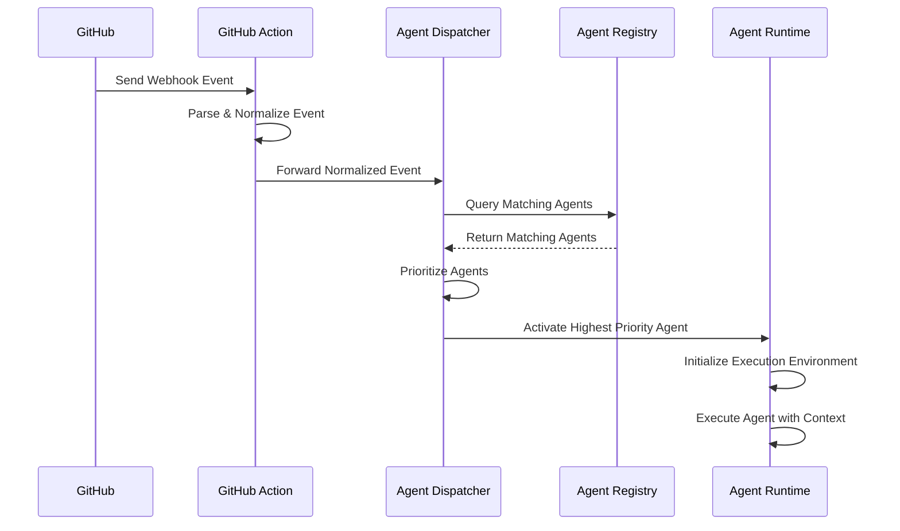
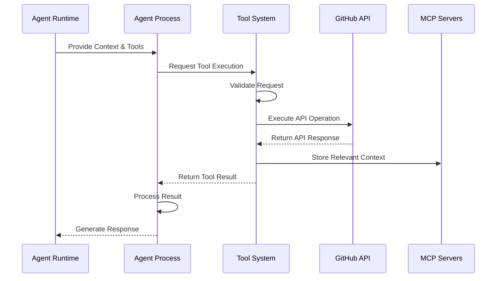
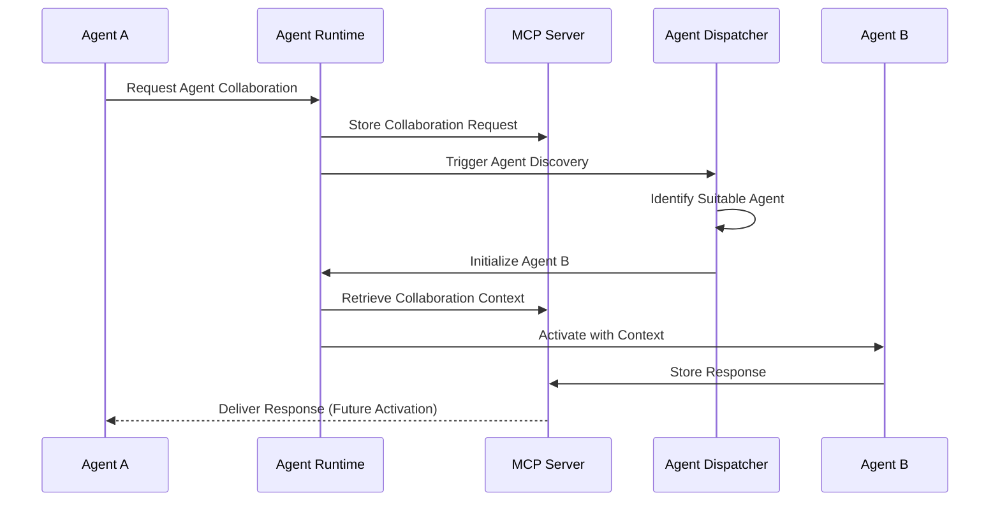

# Data Flow

This document explains how data flows through the A5C system, including key processes, data transformations, and communication paths.

## System Data Flow Overview

The A5C system processes data through a series of coordinated steps, transforming GitHub events into agent actions and system responses.


## Core Data Paths

### 1. Event Ingestion Flow

The primary data flow begins with GitHub events:

```
GitHub Event → GitHub Action → Event Normalization → Agent Dispatcher → Agent Selection → Agent Execution
```

#### Key Data Transformations

1. **GitHub Event to Normalized Event**
   - Raw webhook payload is parsed and validated
   - Event-specific data is extracted
   - Consistent event format is created for agent processing
   - Metadata is enriched with repository context

2. **Normalized Event to Agent Context**
   - Event data is filtered for relevant information
   - Agent-specific context is constructed
   - Trigger conditions are evaluated
   - Execution parameters are defined

### 2. Agent Execution Flow

Once an agent is selected, data flows through the execution process:

```
Agent Context → Agent Runtime → Tool Interactions → Action Generation → Response Processing → GitHub Response
```

#### Key Data Transformations

1. **Agent Context to Agent Instructions**
   - Context is transformed into agent prompt
   - Tool configurations are prepared
   - Memory context is loaded
   - Execution environment is initialized

2. **Agent Instructions to Actions**
   - Agent produces execution plan
   - Tool calls are generated
   - GitHub operations are formulated
   - Response content is created

3. **Actions to GitHub Responses**
   - API calls are executed
   - Comments and PR content are formatted
   - Status updates are published
   - Documentation changes are committed

### 3. Memory and Persistence Flow

Data flows through the MCP servers for persistence and sharing:

```
Agent Memory → MCP Server → Storage/Retrieval → Cross-Agent Sharing → Future Activation Context
```

#### Key Data Transformations

1. **Working Memory to Persistent Storage**
   - Session context is serialized
   - Key information is extracted
   - Embeddings are generated for semantic retrieval
   - Storage format is optimized for retrieval

2. **Stored Memory to Working Context**
   - Relevant history is retrieved
   - Context is prioritized and windowed
   - Memory is formatted for agent consumption
   - Cross-agent knowledge is integrated

## Detailed Process Flows

### Event Trigger Processing



### Agent Tool Interaction



### Inter-Agent Communication



## Data Schemas

### Normalized Event Schema

```json
{
  "event_type": "string",  // e.g., "push", "pull_request", "issue_comment"
  "action": "string",      // e.g., "opened", "closed", "created"
  "repository": {
    "full_name": "string", // e.g., "owner/repo"
    "default_branch": "string",
    "visibility": "string"
  },
  "sender": {
    "login": "string",
    "type": "string"      // e.g., "User", "Bot"
  },
  "payload": {            // Event-specific data
    // Varies by event type
  },
  "ref": "string",        // For branch-related events
  "metadata": {           // A5C-specific context
    "trigger_type": "string",
    "agent_mentions": ["string"],
    "matched_patterns": ["string"]
  }
}
```

### Agent Context Schema

```json
{
  "agent_id": "string",
  "agent_version": "string",
  "event": {
    // Normalized event data
  },
  "repository_context": {
    "files": ["string"],
    "languages": ["string"],
    "branches": ["string"]
  },
  "execution_context": {
    "tools": ["string"],
    "permissions": ["string"],
    "max_runtime": "number",
    "memory_quota": "number"
  },
  "memory_context": {
    "recent_interactions": [],
    "knowledge_items": [],
    "agent_state": {}
  }
}
```

### MCP Memory Item Schema

```json
{
  "id": "string",
  "agent_id": "string",
  "timestamp": "string",
  "type": "string",    // e.g., "state", "knowledge", "interaction"
  "content": {},       // Varies by type
  "metadata": {
    "repository": "string",
    "related_event": "string",
    "importance": "number",
    "ttl": "number"    // Time-to-live in seconds
  },
  "embedding": []      // Vector embedding for semantic search
}
```

## Data Flow Control

A5C implements several mechanisms to control and optimize data flow:

### Filtering and Prioritization

- **Event Filtering**: Ignores irrelevant events early in the pipeline
- **Context Windowing**: Limits context size for efficient processing
- **Priority Queueing**: Processes high-priority agents first
- **Memory Relevance Scoring**: Prioritizes most relevant context

### Flow Control

- **Rate Limiting**: Prevents overwhelming GitHub API
- **Concurrency Management**: Controls parallel execution
- **Backpressure Handling**: Queues work when system is at capacity
- **Timeout Management**: Gracefully handles execution timeouts

### Error Handling

- **Retry Logic**: Automatically retries transient failures
- **Circuit Breaking**: Prevents cascading failures
- **Fallback Strategies**: Provides alternative paths when primary fails
- **Error Enrichment**: Adds context to error messages

## Data Flow Examples

### Example 1: Issue Comment Mention Flow

When a user mentions an agent in an issue comment:

1. GitHub sends issue_comment.created webhook to GitHub Action
2. Action parses event and identifies @agent mention
3. Dispatcher finds agent configuration matching the mention
4. Agent runtime initializes with issue context
5. Agent processes comment content and generates response
6. Response is posted as new comment via GitHub API
7. Key context is stored in MCP for future reference

### Example 2: Pull Request Review Flow

When a pull request is opened:

1. GitHub sends pull_request.opened webhook to GitHub Action
2. Action normalizes event and forwards to Dispatcher
3. Dispatcher identifies code-review-agent with matching trigger
4. Agent runtime initializes with PR context
5. Agent uses GitHub API to fetch changed files
6. Agent analyzes code and generates review comments
7. Review comments are posted to the PR
8. Review summary is stored in MCP server

### Example 3: Inter-Agent Collaboration Flow

When one agent needs assistance from another:

1. First agent identifies need for specialized capability
2. Agent requests collaboration via MCP server
3. Dispatcher is notified of collaboration request
4. Second agent is activated with shared context
5. Second agent performs specialized task
6. Results are stored in MCP server
7. First agent accesses results in subsequent activation
8. Combined output is delivered to GitHub

## Security Considerations

The A5C data flow implements several security measures:

- **Data Validation**: All inputs are validated at system boundaries
- **Permission Boundaries**: Data access follows least-privilege principle
- **Credential Protection**: Sensitive data is isolated and protected
- **Audit Logging**: All data access and transformations are logged
- **Data Minimization**: Only necessary data is passed between components

## Performance Optimizations

A5C optimizes data flow for performance:

- **Parallel Processing**: Independent operations execute concurrently
- **Caching**: Frequently accessed data is cached
- **Lazy Loading**: Data is loaded only when needed
- **Batching**: Related operations are grouped for efficiency
- **Compression**: Large data is compressed during transfer

## Next Steps

For more information about how data flows through specific components:

- [System Overview](system-overview.md) - High-level architecture overview
- [Components](components.md) - Detailed component documentation
- [Integration Points](integration-points.md) - How A5C connects with external systems