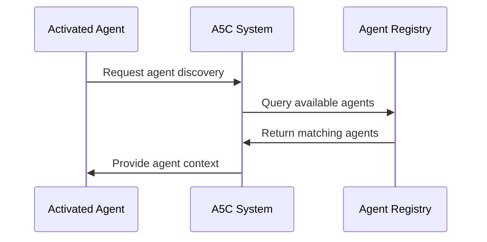
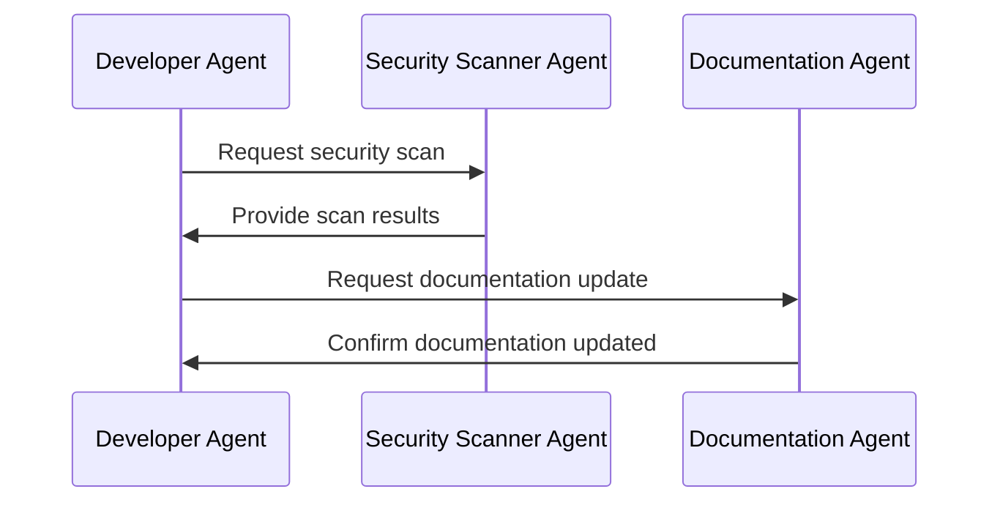
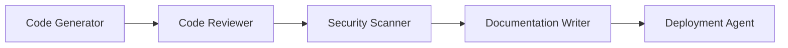
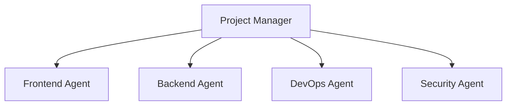
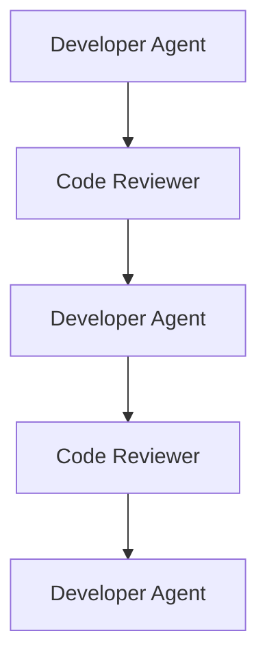
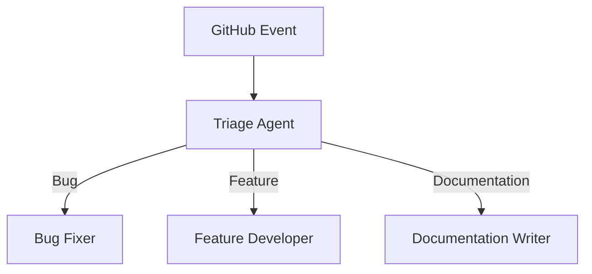

# Agent Discovery

Agent discovery allows agents to find and collaborate with other agents in the a5c system. This page explains how agent discovery works and how to configure it for effective agent collaboration.

## What is Agent Discovery?

Agent discovery is:

1. **A mechanism for agent awareness**: Helps agents know about other agents in the system
2. **A collaboration framework**: Enables agents to work together on complex tasks
3. **A responsibility delegation system**: Allows agents to hand off specialized tasks to more appropriate agents
4. **A context-sharing system**: Facilitates information sharing between agents

## Agent Discovery Benefits

Agent discovery provides several key benefits:

1. **Specialization**: Agents can focus on their core expertise
2. **Efficiency**: Work is distributed to the most appropriate agents
3. **Scalability**: New capabilities can be added by introducing new agents
4. **Coordination**: Complex workflows can be orchestrated across multiple agents
5. **Reduced redundancy**: Agents don't need to duplicate capabilities

## How Agent Discovery Works

The agent discovery process follows these steps:

### 1. Discovery Phase

When an agent is activated, it queries the a5c system for other available agents:



### 2. Context Building

The a5c system builds context information about discovered agents:

```json
{
  "available_agents": [
    {
      "name": "security-scanner",
      "category": "security",
      "description": "Scans code for security vulnerabilities",
      "capabilities": ["vulnerability-detection", "dependency-scanning"],
      "invocation": "@security-scanner"
    },
    {
      "name": "documentation-writer",
      "category": "documentation",
      "description": "Creates and updates documentation",
      "capabilities": ["markdown-generation", "api-docs"],
      "invocation": "@docs"
    }
  ]
}
```

### 3. Collaboration

The activated agent can then collaborate with other agents:



## Agent Discovery Configuration

Agent discovery is configured at both global and agent-specific levels:

### Global Configuration (.a5c/config.yml)

```yaml
# Agent Discovery Settings
agent_discovery:
  enabled: true
  discovery_depth: 2
  max_agents_in_context: 10
  discovery_cache_ttl: 3600  # seconds
  default_include_categories:
    - development
    - security
    - documentation
  default_exclude_categories:
    - experimental
```

### Agent-specific Configuration (.agent.md)

```yaml
# Agent Discovery in agent definition
agent_discovery:
  enabled: true
  include_same_directory: true
  max_agents_in_context: 5
  include_categories:
    - development
    - security
  exclude_categories:
    - experimental
  specific_agents:
    - security-scanner
    - documentation-writer
```

## Discovery Parameters

| Parameter | Description | Default |
|-----------|-------------|---------|
| `enabled` | Enable or disable agent discovery | `true` |
| `discovery_depth` | How many directory levels to search | `2` |
| `max_agents_in_context` | Maximum agents to include in context | `10` |
| `discovery_cache_ttl` | How long to cache discovery results | `3600` (1 hour) |
| `include_same_directory` | Include agents in the same directory | `true` |
| `include_categories` | Categories to include in discovery | `[]` (all) |
| `exclude_categories` | Categories to exclude from discovery | `[]` (none) |
| `specific_agents` | Specific agents to always include | `[]` (none) |

## Collaboration Methods

Agents can collaborate using several methods:

### 1. Direct Mentions

Agents can mention other agents in their output:

```
@security-scanner Please scan this pull request for security vulnerabilities.
```

### 2. Commit Message Mentions

Agents can mention other agents in commit messages:

```
Fix login form validation

@security-scanner Please verify this change doesn't introduce new vulnerabilities.
```

### 3. Issue Creation

Agents can create issues for other agents:

```
// Create an issue for the documentation agent
await mcp.github.createIssue({
  owner: 'a5c-ai',
  repo: 'docs',
  title: 'Update API documentation',
  body: '@documentation-writer Please update the API docs with these new endpoints.',
  labels: ['documentation', 'api']
});
```

### 4. Pull Request Reviews

Agents can request reviews from other agents:

```
// Request a review from the security agent
await mcp.github.requestReview({
  owner: 'a5c-ai',
  repo: 'application',
  pull_number: 123,
  reviewers: ['security-scanner']
});
```

### 5. Workflow Handoffs

Agents can set up workflows that trigger other agents:

```
// Add a label that will trigger the security agent
await mcp.github.addLabels({
  owner: 'a5c-ai',
  repo: 'application',
  issue_number: 456,
  labels: ['needs-security-review']
});
```

## Agent Discovery Strategies

Different strategies can be used for agent discovery:

### 1. Comprehensive Discovery

Include all available agents in the context:

```yaml
agent_discovery:
  enabled: true
  discovery_depth: 3
  max_agents_in_context: 20
  include_categories: []  # All categories
```

### 2. Selective Discovery

Include only specific categories or agents:

```yaml
agent_discovery:
  enabled: true
  discovery_depth: 1
  include_categories:
    - development
    - security
  specific_agents:
    - code-reviewer
    - security-scanner
```

### 3. Local Discovery

Focus on agents in the same directory:

```yaml
agent_discovery:
  enabled: true
  discovery_depth: 0
  include_same_directory: true
```

### 4. Specialized Discovery

Discover agents based on specific criteria:

```yaml
agent_discovery:
  enabled: true
  discovery_mode: "specialized"
  discovery_criteria:
    capabilities: ["code-review", "security-scanning"]
    min_priority: 70
```

## Agent Collaboration Patterns

Common patterns for agent collaboration:

### 1. Pipeline Pattern

Agents form a processing pipeline where each agent performs a specific step:



### 2. Specialist Pattern

A coordinator agent delegates tasks to specialist agents:



### 3. Feedback Loop Pattern

Agents provide iterative feedback to improve results:



### 4. Event-Driven Pattern

Agents respond to events in a reactive manner:



## Best Practices

When using agent discovery:

1. **Be selective with discovery**: Only include agents that are relevant to the current task
2. **Set appropriate context limits**: Too many agents in context can reduce performance
3. **Use clear invocation patterns**: Make it obvious when an agent is being asked to perform a task
4. **Provide complete context**: Give collaborating agents all the information they need
5. **Handle failed collaborations**: Have fallback strategies when agent collaboration fails
6. **Document collaboration patterns**: Make it clear how agents should work together
7. **Avoid circular dependencies**: Prevent agents from creating infinite loops of requests

## Advanced Discovery Features

### 1. Capability-based Discovery

Discover agents based on their capabilities rather than identity:

```yaml
discovery_criteria:
  capabilities:
    - code-generation
    - typescript
    - react
```

### 2. Dynamic Discovery

Adjust discovery parameters based on runtime conditions:

```typescript
// Dynamically adjust discovery based on task complexity
if (task.complexity === 'high') {
  discoveryParams.maxAgentsInContext = 15;
  discoveryParams.includeCategories = ['security', 'performance'];
} else {
  discoveryParams.maxAgentsInContext = 5;
}
```

### 3. Prioritized Discovery

Discover agents based on priority and relevance:

```yaml
discovery_criteria:
  min_priority: 70
  relevance_factors:
    - file_type_match
    - category_match
    - previous_collaboration_success
```

## Troubleshooting Agent Discovery

Common issues and their solutions:

| Issue | Possible Causes | Solutions |
|-------|-----------------|-----------|
| Agents not discovered | Incorrect configuration, depth too low | Check discovery settings, increase depth |
| Too many agents in context | Discovery too broad, limits too high | Narrow discovery criteria, reduce limits |
| Agent collaboration fails | Missing context, incompatible agents | Provide complete context, verify compatibility |
| Circular collaboration | Agents calling each other endlessly | Implement collaboration depth limits |
| Performance issues | Too frequent discovery, cache issues | Adjust cache settings, optimize discovery |

## Next Steps

- Learn about [CLI integration](cli-integration.md) for command-line tools
- Explore [agent configuration](configuration.md) for discovery settings
- Understand [Model Context Protocol](mcp.md) for agent communication
- See the [A5C Registry Repository](https://github.com/a5c-ai/registry) for practical examples of agent collaboration