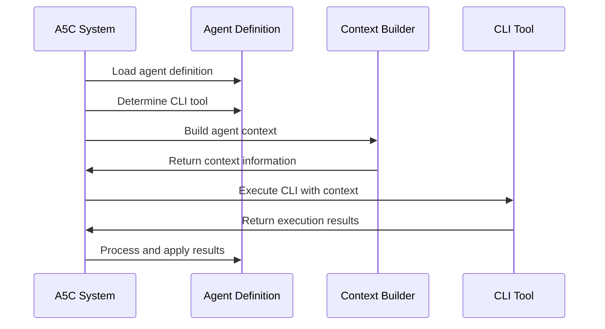

# CLI Integration

A5C supports multiple CLI tools for agent execution, including Claude, Aider, and Cursor. This page explains how CLI integration works and how to configure and use different CLI tools with A5C.

## CLI Integration Overview

CLI integration allows A5C agents to:

1. **Execute through familiar tools**: Use existing CLI tools developers are comfortable with
2. **Leverage tool-specific features**: Take advantage of specialized capabilities
3. **Choose the right tool for the task**: Different tools excel at different types of tasks
4. **Maintain consistent agent behavior**: Agents work the same regardless of the execution tool

## Supported CLI Tools

A5C supports several CLI tools out of the box:

### 1. Claude CLI

<!-- Note: The specific Claude CLI described here may refer to a compatible CLI tool for interacting with Claude models, not necessarily an official Anthropic product. Check the latest documentation for currently supported CLI tools. -->

Claude CLI refers to a command-line interface for interacting with Claude AI models.

**Key features:**
- Direct access to Claude models
- Local file system integration
- Command history and resume capabilities
- Supports all Claude models
- Session management

**Ideal for:**
- General-purpose agent execution
- Tasks requiring the latest Claude capabilities
- Projects with complex context requirements

### 2. Aider

[Aider](https://github.com/paul-gauthier/aider) is an AI pair programming tool that edits code in your local Git repository.

**Key features:**
- Git integration
- Code editing
- Voice input support
- Universal ctags integration
- Chat history

**Ideal for:**
- Coding-focused agents
- Git repository operations
- Projects requiring direct code manipulation

### 3. Cursor

[Cursor](https://cursor.sh/) is an AI-native code editor with built-in AI capabilities.

**Key features:**
- Integrated code editor
- Code completion
- Code explanation
- Code generation
- Refactoring assistance

**Ideal for:**
- Agents that require visual code editing
- Complex refactoring tasks
- Visual interface preferences

### 4. Continue

[Continue](https://github.com/continuedev/continue) is an open-source autopilot for software development.

**Key features:**
- VSCode and JetBrains extension
- Command generation
- Context-aware coding
- Custom commands
- Multi-step workflows

**Ideal for:**
- IDE-integrated workflows
- Step-by-step guided development
- Complex multi-file changes

### 5. Custom CLI Tools

A5C supports custom CLI tools through its extensible integration system.

**Requirements:**
- Command-line interface
- Support for reading prompt files
- Ability to process context information

## CLI Configuration

CLI tools are configured in the global config and agent definitions:

### Global Configuration (.a5c/config.yml)

```yaml
# CLI Tool Configuration
cli_tools:
  claude:
    enabled: true
    path: "claude"
    models:
      - claude-3-7-sonnet-20250219
      - claude-3-5-sonnet-20240620
    arguments: "--history auto --verbose"
    environment:
      CLAUDE_API_KEY: "${CLAUDE_API_KEY}"
      
  aider:
    enabled: true
    path: "aider"
    models:
      - claude-3-7-sonnet-20250219
    arguments: "--no-stream --edit-format tokens"
    environment:
      ANTHROPIC_API_KEY: "${ANTHROPIC_API_KEY}"
      
  cursor:
    enabled: true
    path: "/usr/local/bin/cursor"
    models:
      - claude-3-7-sonnet-20250219
    arguments: "--headless"
    
  continue:
    enabled: true
    path: "continue"
    models:
      - claude-3-7-sonnet-20250219
    arguments: "--no-input"
```

### Agent-specific Configuration (.agent.md)

```yaml
# CLI Tool Configuration in agent definition
cli_tool: claude  # Primary CLI tool to use
fallback_cli_tools: ["aider", "cursor"]  # Fallbacks if primary is unavailable
cli_arguments: "--memory --history auto"  # Tool-specific arguments
```

## CLI Execution Process

When an agent is triggered, A5C follows this process for CLI execution:



The execution process includes:

1. **Agent loading**: Loading the agent definition and configuration
2. **CLI selection**: Determining which CLI tool to use
3. **Context building**: Gathering context information for the agent
4. **Command construction**: Building the CLI command with appropriate arguments
5. **Execution**: Running the CLI tool with the agent prompt and context
6. **Result processing**: Handling the output from the CLI tool

## Claude CLI Integration

Claude CLI is the default tool for A5C agents. Here's how to configure it:

### Basic Configuration

```yaml
# Claude CLI configuration
cli_tools:
  claude:
    enabled: true
    path: "claude"
    arguments: "--memory --history auto"
    environment:
      CLAUDE_API_KEY: "${CLAUDE_API_KEY}"
```

### Advanced Configuration

```yaml
# Advanced Claude CLI configuration
cli_tools:
  claude:
    enabled: true
    path: "claude"
    models:
      - claude-3-7-sonnet-20250219
      - claude-3-5-sonnet-20240620
      - claude-3-opus-20240229
    arguments: "--memory --history auto --max-tokens 4000"
    environment:
      CLAUDE_API_KEY: "${CLAUDE_API_KEY}"
      CLAUDE_ORGANIZATION_ID: "${ORG_ID}"
    timeout: 300
    retries: 3
    cache:
      enabled: true
      ttl: 3600
```

### Example Usage

```bash
# Example CLI command format - actual implementation details may vary
# Check the current documentation for the exact command format
claude --memory --history auto --model claude-3-7-sonnet-20250219 \
  --prompt-file /path/to/agent/prompt.md \
  --context /path/to/context.json
```

## Aider Integration

Aider is ideal for code-focused agents. Here's how to configure it:

### Basic Configuration

```yaml
# Aider configuration
cli_tools:
  aider:
    enabled: true
    path: "aider"
    arguments: "--no-stream"
    environment:
      ANTHROPIC_API_KEY: "${ANTHROPIC_API_KEY}"
```

### Advanced Configuration

```yaml
# Advanced Aider configuration
cli_tools:
  aider:
    enabled: true
    path: "aider"
    models:
      - claude-3-7-sonnet-20250219
    arguments: "--no-stream --edit-format tokens --map-tokens --git-timeout 60"
    environment:
      ANTHROPIC_API_KEY: "${ANTHROPIC_API_KEY}"
    repo_config:
      commit_message_prefix: "[A5C] "
      auto_commit: true
```

### Example Usage

```bash
# Example Aider command format - actual implementation details may vary
# Check the current documentation for exact command syntax and parameters
aider --no-stream --edit-format tokens --model claude-3-7-sonnet-20250219 \
  --prompt-file /path/to/agent/prompt.md \
  --repo /path/to/repository
```

## Cursor Integration

Cursor provides an IDE-like experience. Here's how to configure it:

### Basic Configuration

```yaml
# Cursor configuration
cli_tools:
  cursor:
    enabled: true
    path: "/usr/local/bin/cursor"
    arguments: "--headless"
```

### Advanced Configuration

```yaml
# Advanced Cursor configuration
cli_tools:
  cursor:
    enabled: true
    path: "/usr/local/bin/cursor"
    models:
      - claude-3-7-sonnet-20250219
    arguments: "--headless --disable-telemetry"
    environment:
      CURSOR_API_KEY: "${CURSOR_API_KEY}"
    editor_config:
      theme: "dark"
      font_size: 14
```

### Example Usage

```bash
# Example Cursor command format - actual implementation details may vary
# Verify current Cursor CLI parameters and headless mode capabilities
/usr/local/bin/cursor --headless \
  --prompt-file /path/to/agent/prompt.md \
  --workspace /path/to/workspace
```

## Continue Integration

Continue offers automated workflows. Here's how to configure it:

### Basic Configuration

```yaml
# Continue configuration
cli_tools:
  continue:
    enabled: true
    path: "continue"
    arguments: "--no-input"
```

### Advanced Configuration

```yaml
# Advanced Continue configuration
cli_tools:
  continue:
    enabled: true
    path: "continue"
    models:
      - claude-3-7-sonnet-20250219
    arguments: "--no-input --context-limit 20"
    environment:
      ANTHROPIC_API_KEY: "${ANTHROPIC_API_KEY}"
    workflow_config:
      steps_per_workflow: 5
      confirm_steps: false
```

### Example Usage

```bash
# Example Continue command format - actual implementation details may vary
# Verify current Continue CLI parameters and capabilities
continue --no-input \
  --prompt-file /path/to/agent/prompt.md \
  --task "Implement feature X"
```

## Custom CLI Tool Integration

You can integrate custom CLI tools with A5C:

### 1. Define Tool Configuration

```yaml
# Custom CLI tool configuration
cli_tools:
  custom_tool:
    enabled: true
    path: "/path/to/custom/tool"
    models:
      - claude-3-7-sonnet-20250219
    arguments: "--custom-arg value"
    environment:
      CUSTOM_API_KEY: "${CUSTOM_API_KEY}"
```

### 2. Create Adapter

```javascript
// Example custom tool adapter implementation - actual adapter code may vary
// This is a conceptual example showing how a custom adapter might be structured
// custom-tool-adapter.js
class CustomToolAdapter {
  constructor(config) {
    this.config = config;
  }
  
  buildCommand(agent, context, options) {
    // Build command for the custom tool
    return {
      command: this.config.path,
      args: [
        '--prompt-file', options.promptFile,
        '--context', options.contextFile,
        ...this.parseArguments(this.config.arguments)
      ],
      env: this.buildEnvironment()
    };
  }
  
  parseArguments(argsString) {
    // Parse arguments string into array
    return argsString.split(' ');
  }
  
  buildEnvironment() {
    // Set up environment variables
    return {
      ...process.env,
      ...this.config.environment
    };
  }
  
  parseResults(output) {
    // Parse tool output
    return {
      result: output,
      actions: this.extractActions(output)
    };
  }
  
  extractActions(output) {
    // Extract actions from output
    // Implementation details would go here
  }
}

module.exports = CustomToolAdapter;
```

### 3. Register Adapter

```javascript
// cli-registry.js
const { CliRegistry } = require('@a5c/core');
const CustomToolAdapter = require('./custom-tool-adapter');

// Register custom tool adapter
CliRegistry.register('custom_tool', CustomToolAdapter);
```

## CLI Tool Selection Logic

A5C uses the following logic to select a CLI tool:

1. Check agent-specific `cli_tool` configuration
2. If not specified or unavailable, check agent category defaults
3. If not specified or unavailable, use the system default (usually Claude CLI)
4. If the selected tool is unavailable, try fallbacks in order

```javascript
function selectCliTool(agent, availableTools) {
  // Check agent-specific tool
  if (agent.cli_tool && availableTools.includes(agent.cli_tool)) {
    return agent.cli_tool;
  }
  
  // Check category defaults
  const categoryDefaults = getCategoryDefaults(agent.category);
  if (categoryDefaults && availableTools.includes(categoryDefaults)) {
    return categoryDefaults;
  }
  
  // Try fallbacks
  if (agent.fallback_cli_tools) {
    for (const fallback of agent.fallback_cli_tools) {
      if (availableTools.includes(fallback)) {
        return fallback;
      }
    }
  }
  
  // Use system default
  return 'claude';
}
```

## CLI Tool Best Practices

When working with CLI tools:

1. **Match tools to tasks**: Use coding-focused tools for code tasks, general tools for others
2. **Set appropriate timeouts**: Consider the complexity of tasks when setting timeouts
3. **Configure model access**: Ensure tools have access to the required models
4. **Secure API keys**: Use environment variables for API keys, never hardcode them
5. **Test tool integration**: Verify that tools work as expected with your agents
6. **Handle tool-specific outputs**: Different tools may produce different output formats
7. **Provide fallbacks**: Configure alternative tools in case the primary tool is unavailable

## CLI Environment Variables

Common environment variables used with CLI tools:

| Variable | Description | Used By |
|----------|-------------|---------|
| `CLAUDE_API_KEY` | API key for Claude API | Claude CLI |
| `ANTHROPIC_API_KEY` | API key for Anthropic API | Aider, Continue |
| `CURSOR_API_KEY` | API key for Cursor | Cursor |
| `GITHUB_TOKEN` | GitHub authentication token | All tools for GitHub integration |
| `A5C_CLI_TIMEOUT` | Default timeout for CLI operations | All tools |
| `A5C_LOG_LEVEL` | Logging verbosity | All tools |

## Troubleshooting CLI Integration

Common issues and their solutions:

| Issue | Possible Causes | Solutions |
|-------|-----------------|-----------|
| CLI tool not found | Incorrect path, not installed | Verify installation, check path configuration |
| Authentication failures | Invalid or expired API keys | Update API keys, check environment variables |
| Timeout errors | Long-running operations | Increase timeout settings, optimize prompts |
| Incompatible models | Tool doesn't support the specified model | Check model compatibility, use supported models |
| Context overflows | Too much context for the tool | Reduce context size, optimize context building |

## Next Steps

- Learn about [agent configuration](configuration.md) for CLI settings
- Explore [agent discovery](agent-discovery.md) for agent collaboration
- Understand [Model Context Protocol](mcp.md) for tool integration
- See [configuring CLI tools](../guides/configuring-cli-tools.md) for practical examples
